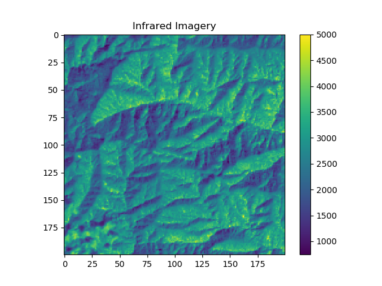
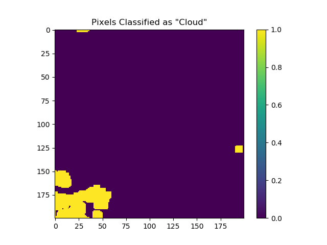
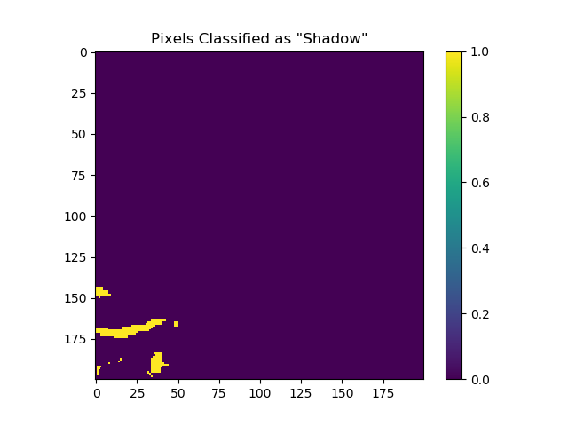
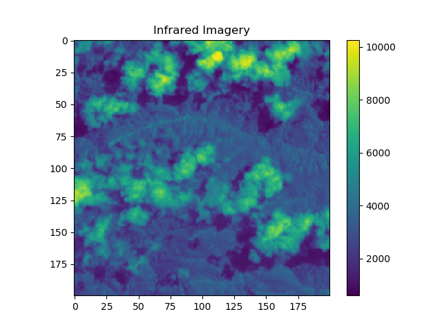
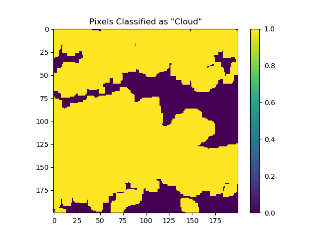
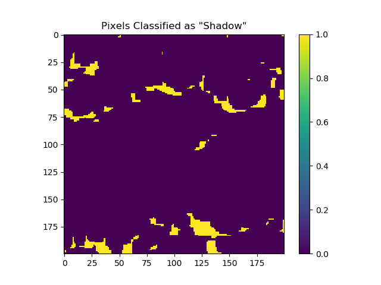
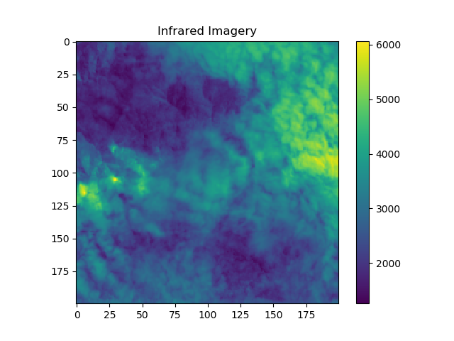
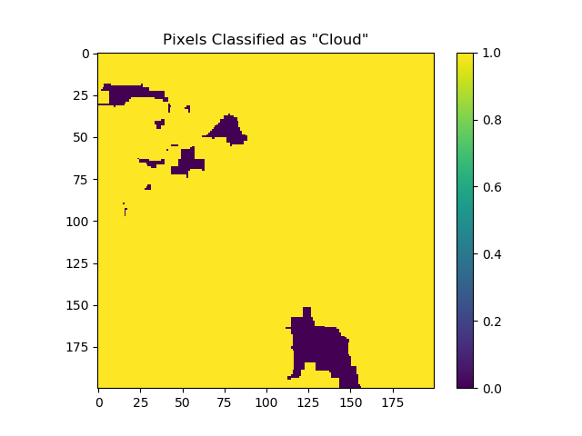
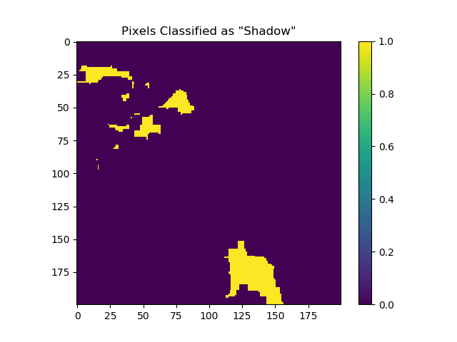

# iwildcam2020-rs-demo
The script `iwildcam_rs_minimal.py` (together with `iwildcam_rs_utils.py`) is meant to demonstrate the structure of the remote sensing data. 

## Details 
Running the command
```
python iwildcam_rs_minimal.py --rs-path /path/to/rs/data/iwildcam_rs_npy --site 107
```
will choose a random time point for site `107` and parse the corresponding infrared imagery and a mask representing the pixels classified as *cloud* or *shadow* according to the `pixelqa` data. Files are saved to the same directory as the script. 

Remote sensing imagery can be challenging to work with. One big issue is cloud cover. The `pixelqa` data provides a rough estimate of which pixels correspond to e.g. clouds or shadows. One use for this data is to combine imagery from multiple time points at the same location to filter out clouds. However, all of the `pixelqa` and `radsatqa` data should be taken with a grain of salt since it has (mostly) not been manually validated.

## Sample Images
To get an intuitive feel for how these images look, here are some examples. If you're lucky, the above command might get you something like this:







More moderate cloud cover looks like this: 







Heavy cloud cover looks like this: 







Cloud cover is ubiquitous, and "good" images like the first one are not the norm!

## Further Reading

[This](https://www.mdpi.com/2072-4292/10/9/1363) is a nice reference to learn more about Landsat imagery in general. 
